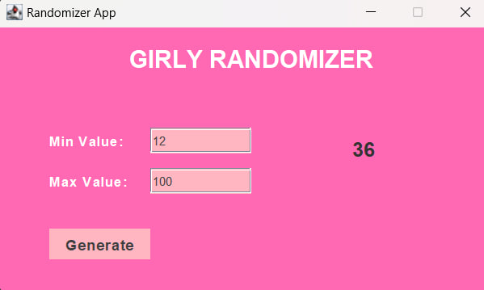
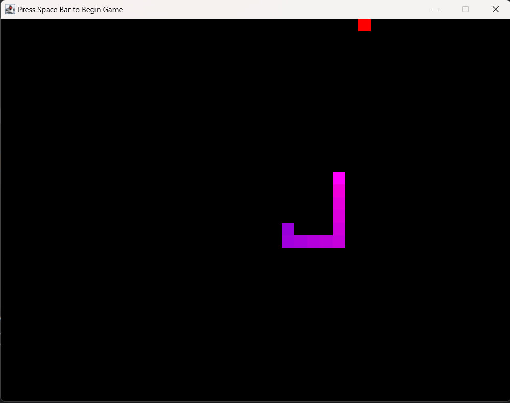
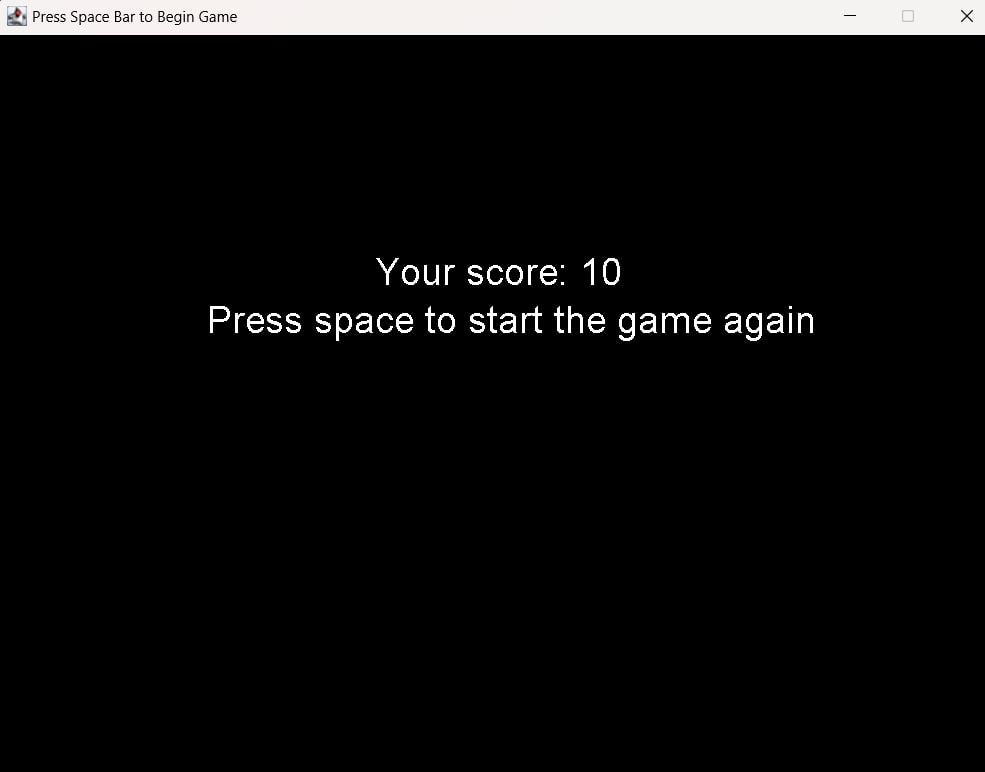
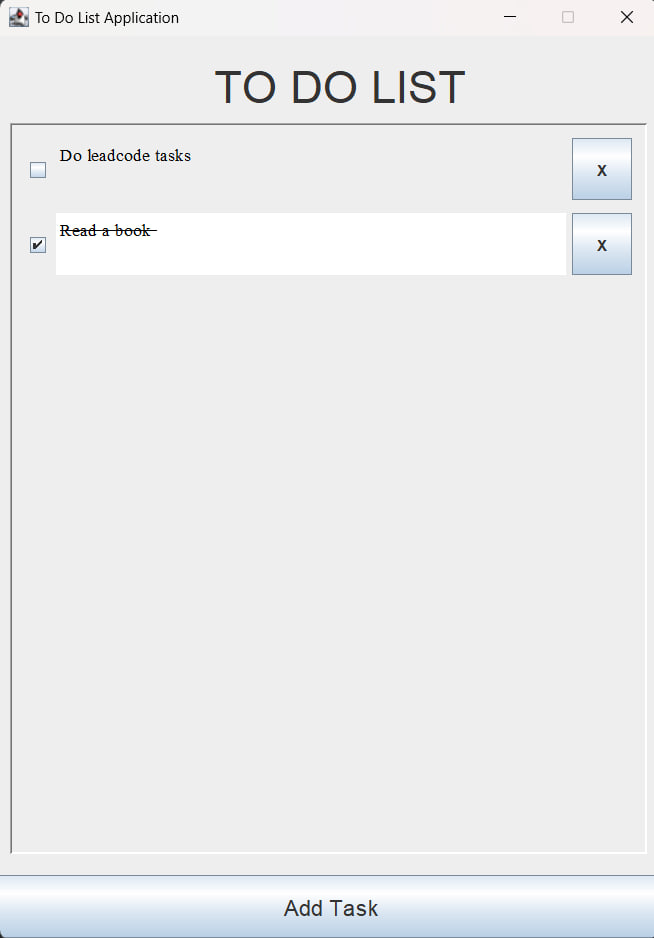

# ☕ Java Projects

**Small projects built with Java** — from GUI applications to simple games.  
Each project is self-contained and showcases different features like Swing, logic handling, and interactivity.

---

## 🗂️ Projects Overview

### 🎀 Randomizer

A pink-themed random number generator with min/max input.

📁 [View Code](./Randomizer)

---

### 🐍 Snake Game

A classic snake game clone with colorful visuals and two screenshots:
- Game field
- Game over screen

📷 Gameplay:

| Field | Game Over |
|-------|-----------|
|  |  |

📁 [View Code](./Games)

---

### ✅ ToDo List

A simple ToDo List app to manage tasks using a user-friendly interface.

📁 [View Code](./ToDOList)

---
